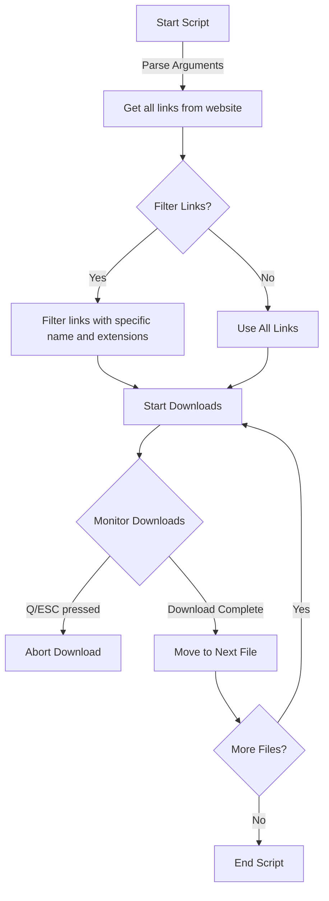

# Filtered Feb Fetcher Flow Diagram

```mermaid

flowchart TD
    Start[Start Script] -->|Parse Arguments| A[Get all links from website]
    A --> B{Filter Links?}
    B -->|Yes| C[Filter links with specific name and extensions]
    B -->|No| D[Use All Links]
    C --> E[Start Downloads]
    D --> E
    E --> F{Monitor Downloads}
    F -->|Q/ESC pressed| G[Abort Download]
    F -->|Download Complete| H[Move to Next File]
    H --> I{More Files?}
    I -->|Yes| E
    I -->|No| End[End Script]

```
